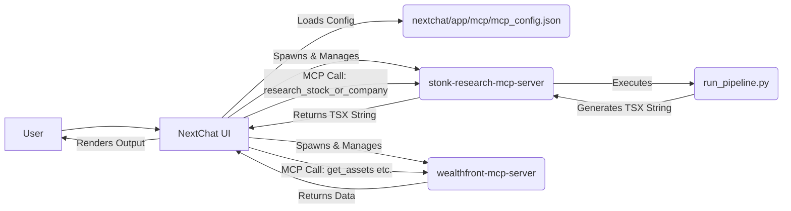

# Slow Takeoff

A financial research and portfolio analysis platform that integrates stock research capabilities with WealthArc portfolio data through Model Context Protocol (MCP) servers and NextChat.

## Overview

This project provides AI-powered financial research and portfolio analysis through:

1. **Stock Research MCP Server**: Performs comprehensive stock research and generates interactive TSX visualizations
2. **WealthArc MCP Server**: Connects to the WealthArc API for portfolio data access and analysis
3. **NextChat Integration**: A chat interface that can interact with both MCP servers

The system uses the Model Context Protocol (MCP) to enable AI models to access external tools and data sources, creating a powerful financial analysis platform.

## MCP Servers

### Stock Research MCP Server

The Stock Research MCP server provides tools for researching stocks and companies, generating comprehensive analysis and interactive visualizations.

**Key Components:**
- `stonk_research_agent`: Gathers stock-related information and produces structured research data
- `project_agents/dashboard_agent`: Generates TSX code for news display
- `run_pipeline.py`: Orchestrates agent calls and outputs TSX string

**Available Tools:**
- `research_stock_or_company`: Runs the full pipeline for a given stock/company and returns a TSX string for UI components

### WealthArc MCP Server

The WealthArc MCP server connects to the WealthArc API to provide access to portfolio data and financial metrics.

**Available Tools:**
- `get_assets`: Fetch assets from WealthArc API
- `get_portfolios`: Fetch portfolios from WealthArc API
- `get_positions`: Fetch positions from WealthArc API
- `get_transactions`: Fetch transactions from WealthArc API
- `get_portfolios_daily_metrics`: Fetch portfolio daily metrics from WealthArc API

## User Interfaces and TSX Artifacts

### What are TSX Artifacts?

TSX artifacts are dynamically generated TypeScript React (TSX) code snippets that create interactive visualizations of financial data. The stock research agent generates these TSX components to display research results, news, and analysis in a visually appealing and interactive format.

### Dashboard UI

The project includes a standalone dashboard UI (`dashboard/`) where the TSX artifact feature is fully implemented and working:

**Key Features:**
- Calls the stock research agent via API
- Receives TSX code strings from the agent
- Compiles and renders the TSX with Tailwind CSS styling
- Displays interactive financial visualizations

### NextChat Integration (Experimental)

NextChat is intended to serve as the primary user interface, managing MCP servers and rendering TSX artifacts. However, this integration is currently **experimental** and not fully tested.

**Current Implementation Status:**
- MCP server lifecycle management (spawning, monitoring) is working
- Code for intercepting MCP responses and preparing HTML artifacts exists
- TSX rendering with dynamic Tailwind CSS is implemented but requires further testing
- The full workflow has been coded but needs debugging and refinement

**Planned TSX Artifact Workflow in NextChat:**
1. User calls `research_stock_or_company` tool from the stock research MCP server
2. The server returns a TSX string
3. NextChat intercepts this response and calls the Tailwind CSS generator
4. NextChat constructs a full HTML document and posts it as an artifact
5. The chat message is updated with an artifact reference
6. NextChat renders the artifact using an iframe

Getting the TSX artifacts working in NextChat should be relatively straightforward as most of the code is already in place, but it requires additional testing and debugging.

## Running the Components

### Prerequisites

- Python 3.10+
- Node.js 18+
- OpenAI API key
- WealthArc API key

### Running the Stock Research Agent Separately

1. Set up environment variables:
   ```bash
   export OPENAI_API_KEY=your_openai_api_key
   export FINNHUB_API_KEY=your_finnhub_api_key
   export ALPHAVANTAGE_API_KEY=your_alphavantage_api_key
   # Add other required API keys as needed
   ```

2. Run the stock research agent directly:
   ```bash
   python run_stonk_agent.py "AAPL"
   ```

3. Or run the full pipeline:
   ```bash
   python run_pipeline.py "AAPL"
   ```

### Running NextChat with MCP Servers

1. Configure NextChat environment:
   ```bash
   cd nextchat
   cp .env.template .env.local
   ```

2. Edit `.env.local` to include:
   ```
   OPENAI_API_KEY=your_openai_api_key
   ENABLE_MCP=true
   ```

3. Start NextChat:
   ```bash
   cd nextchat
   yarn install
   yarn dev
   ```

4. NextChat will automatically manage MCP servers as configured in `nextchat/app/mcp/mcp_config.json`

### Running MCP Servers Independently

#### Stock Research MCP Server

```bash
node /path/to/stonk-research-mcp-server/build/index.js
```

Environment variables required:
```
NODE_ENV=development
OPENAI_API_KEY=your_openai_api_key
# Optional but recommended for full functionality:
FINNHUB_API_KEY=your_finnhub_api_key
ALPHAVANTAGE_API_KEY=your_alphavantage_api_key
FRED_API_KEY=your_fred_api_key
EIA_API_KEY=your_eia_api_key
NEWSAPI_API_KEY=your_newsapi_api_key
```

#### WealthArc MCP Server

```bash
node /path/to/wealthfront-mcp-server/build/index.js
```

Environment variables required:
```
NODE_ENV=development
WEALTH_ARC_API_KEY=your_wealtharc_api_key
VIDAR_BASE_URL=https://api.wealthdatabox.com/v1/
```

## Usage Examples

### Researching a Stock via Dashboard UI (Working)

1. Start the dashboard UI:
   ```bash
   cd dashboard
   npm run dev
   ```
2. Navigate to the dashboard in your browser (typically http://localhost:3000)
3. Enter a stock symbol or company name in the search field
4. The dashboard will call the stock research agent and display the results as interactive TSX components

### Researching a Stock via NextChat

1. Start NextChat with MCP enabled
2. In the chat interface, ask a question like:
   ```
   Research Apple stock and show me recent news
   ```
3. NextChat will call the `research_stock_or_company` tool from the stock research MCP server
4. The result will be displayed as text in the chat (the TSX rendering feature is not yet finished)

### Accessing Portfolio Data via NextChat

1. Start NextChat with MCP enabled
2. In the chat interface, ask a question like:
   ```
   Show me my portfolio information
   ```
3. NextChat will call the appropriate tools from the WealthArc MCP server
4. The portfolio data will be displayed as text in the chat (no TSX visualization yet)

## Technical Architecture

The system follows a client-server architecture with several innovative technical features:

### Core Architecture



### Dynamic Tailwind CSS Generation

A key technical innovation in this project is the dynamic Tailwind CSS generation for runtime-created TSX components:

1. In the Dashboard UI:
   - The API route saves the agent's TSX output to a temporary file
   - Executes `npx tailwindcss` CLI against this file
   - Reads the resulting CSS
   - Returns both TSX and CSS to the frontend
   - Frontend injects the CSS and renders the compiled TSX

2. In NextChat (experimental):
   - The `/api/generate-tailwind-css` route processes TSX strings
   - Generates CSS for classes used in the agent's output
   - Returns the CSS to be included in the HTML artifact

This approach solves the challenge of applying Tailwind styles to dynamically generated TSX content that wasn't available during build time.

### Client-Side TSX Compilation

Another key feature is the client-side compilation of TSX strings:

1. In the Dashboard UI:
   - Uses Babel Standalone (`@babel/standalone`) loaded via CDN
   - Compiles the TSX string into executable JavaScript at runtime
   - Creates React elements that can be rendered in the DOM

2. In NextChat (experimental):
   - Similar approach using Babel for compilation
   - Renders the compiled components within an iframe for isolation

### Key Files and Their Roles

#### Dashboard UI
- `dashboard/src/app/api/generate-dashboard/route.ts`: API route that executes the pipeline and handles TSX/CSS generation
- `dashboard/src/app/page.tsx`: Main UI that renders the compiled TSX components
- `dashboard/tailwind.config.mjs`: Tailwind configuration for the dashboard

#### NextChat Integration
- `nextchat/app/mcp/mcp_config.json`: Configuration for MCP servers
- `nextchat/app/store/chat.ts`: Logic for intercepting MCP responses and preparing artifacts
- `nextchat/app/components/chat.tsx`: Logic for detecting artifact messages and rendering previews
- `nextchat/app/api/generate-tailwind-css/route.ts`: API for dynamically generating Tailwind CSS

#### MCP Servers
- `stonk-research-mcp-server/build/index.js`: Entry point for the stock research MCP server
- `wealthfront-mcp-server/build/index.js`: Entry point for the WealthArc MCP server

#### Backend Components
- `run_pipeline.py`: Orchestrates the backend process
- `stonk_research_agent/agent.py`: Performs stock research
- `project_agents/dashboard_agent/agent.py`: Generates TSX code

## Troubleshooting

- **API Key Issues**: Ensure all required API keys are correctly set in environment variables
- **NextChat MCP Connection**: Verify `ENABLE_MCP=true` is set in `.env.local`
- **MCP Server Errors**: Check server logs for detailed error messages
- **TSX Rendering Issues**: Inspect the generated HTML artifact and CSS in NextChat
